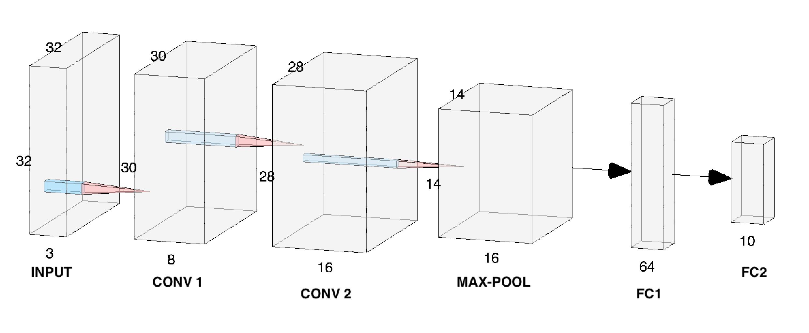

# CNN from scratch using only Numpy
I developed this project because I wanted to deeply understand the mathematics behind the learning process of a neural network.

The architecture is based on a VGG block, and the goal is to perform image classification.

 

The model has been trained both on CIFAR10 and MNIST.

## TODO
* Add bias to convolutional layers
* complete the documentation by adding examples for better understanding the math
* remove some configuration flags useful for the project presentation only
